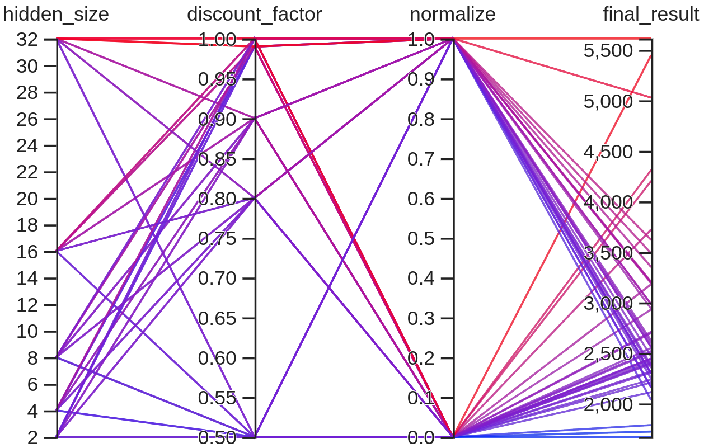
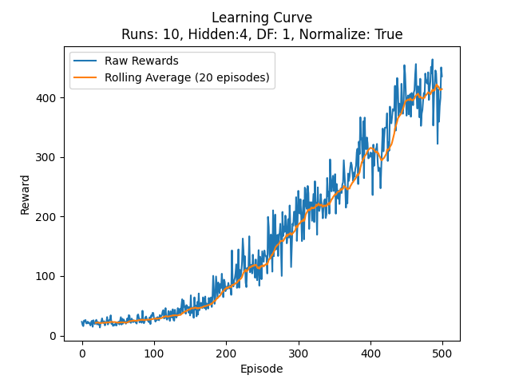
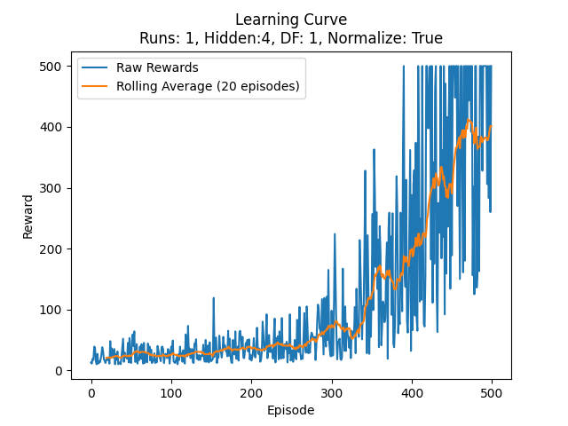

# REINFORCE CartPole Project

[](https://github.com/MMahdiSetak/CartPoleRL/blob/main/LICENSE)

## Description

The REINFORCE CartPole Project is a reinforcement learning endeavor focused on mastering the classic CartPole balancing
task. Utilizing the REINFORCE algorithm, an agent learns to balance a pole on a moving cart. The agent's learning
process and decision-making are powered by a neural network. All training results, including hyperparameter tuning, are
visualized and logged with TensorBoard, providing insights into the learning journey.

## Prerequisites

- Python 3.x (developed with 3.10)
- pip

## Installation

1. Clone this repository to your local machine.
2. Navigate to the project directory and install the required libraries using the `requirements.txt` file:
    ```bash
    pip install -r requirements.txt
    ```

## Usage

1. Run the main training script:
    ```bash
    python main.py
    ```

2. To visualize training progress, use TensorBoard:
    ```bash
    tensorboard --logdir=cartpole_tensorboard
    ```

## Features

- **Hyperparameter Grid Search**: Comprehensive exploration of parameter space to optimize performance.
- **Visualization**: The `utils.py` offers robust tools for plotting learning curves and visual demonstrations of the
  agent's expertise.
- **Policy Network**: A lean and efficient neural network, as detailed in `model.py`, underpins the agent's policy.
- **Trajectory Collection and Training**: The `policy.py` equips users with functions for trajectory collection and
  REINFORCE algorithm-based training.

## Results

Visual insights into the project's performance:

- **Hyperparameter Grid Search**:
  
- **Learning Curve** (Average of 10 runs):
  
- **Learning Process Visualization**:
  
- **Sample Learning Curve**:
  
- **Sample Performance**:
  

## Models

All trained models are diligently saved in the `assets/saved_models` directory. As an example, the model trained with a
hidden layer of size 4 is available [here](./assets/saved_models/model_4.pth).

## Contributing

We welcome all contributions:

1. Fork the Project
2. Create your Feature Branch (`git checkout -b feature/AmazingFeature`)
3. Commit your Changes (`git commit -m 'Add some AmazingFeature'`)
4. Push to the Branch (`git push origin feature/AmazingFeature`)
5. Open a Pull Request

## License

Distributed under the MIT License. See [`LICENSE`](./LICENSE) for more information.